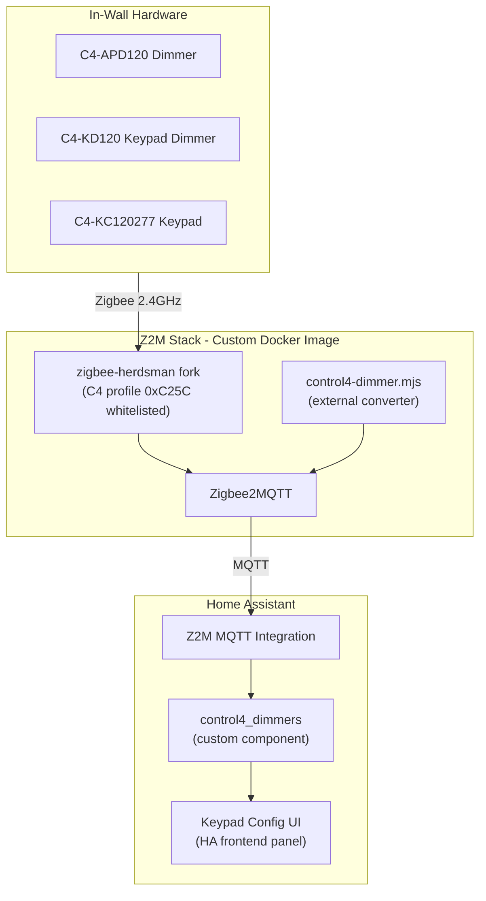

# Control4 Zigbee Integration for Home Assistant

## Current State

**Custom HA integration** (`control4_dimmers`): Fully functional custom component with:

- MQTT-based device discovery from Zigbee2MQTT (`bridge/devices`)
- Automatic device type detection (dimmer / keypad-dimmer / keypad) via `c4_device_type` MQTT field
- Device-type select entities with override support
- Button entities for each configured slot (sends `c4.dmx.bp` commands via MQTT)
- Event entities for each physical button slot (fires `press`, `double_press`, `triple_press`, `quadruple_press`)
- LED light entities per slot (on/off color control via MQTT)
- Persistent device configuration storage
- Bundled Lovelace card (`control4-dimmer-card`) with:
  - Dashboard view: interactive keypad (press/double-tap buttons), brightness/state display
  - Configuration editor: device type, button slot layout, LED colors, behaviors, automation linking
  - Frontend/backend version sync with toast notification
- WebSocket API for card-to-backend communication
- Development simulator (`scripts/simulate_devices.py`) with fake Control4 devices

**Custom Z2M Docker image** (`z2m/`): Production Docker image bundling our converter + herdsman profile patch. Currently running in production.

## Architecture



## The Arc: 7 Phases (3 Newer Device Types Only -- No C4-KP6-Z)

### Phase 1: Clean Converter + Test Framework

Build a clean converter with a test harness.

**Directory structure:**

```
z2m/
  converters/
    control4.mjs           -- main converter
  tests/
    control4.test.mjs      -- unit tests for the converter
    fixtures/               -- mock device data, sample C4 responses
  package.json             -- vitest + zigbee-herdsman-converters dev dep
```

**Test coverage targets:**

- Color conversion: HSV-to-RGB, XY-to-RGB, gamma correction, round-trip fidelity
- C4 text protocol: command formatting, sequence numbering, response parsing
- LED color response parsing (`parseLedColorResponse`, `parseDimResponse`)
- Device detection logic (dimmer/keypaddim/keypad from `c4.dmx.dim` response)
- Button event parsing (bp, cc, sc patterns)
- fromZigbee: response queue mechanism, pending query resolution + timeout
- toZigbee: LED set command generation, batch mode, single mode
- Edge cases: empty responses, malformed text, timeout behavior

**Testing approach:** Use `vitest` with mocked `device.getEndpoint()` / `endpoint.sendRequest()`. The converter's architecture (pure functions for parsing, async functions for I/O) makes it naturally testable -- mock the I/O layer and test the logic directly.

### Phase 2: Herdsman Fork with C4 Profile Patch

The EZSP adapter in `zigbee-herdsman` silently drops messages on non-standard Zigbee profiles.

**Proper fix:** Fork `zigbee-herdsman`, apply the patch as a source-level change, publish as a scoped npm package or reference via git URL.

**The patch itself is small** (one line in `src/adapter/ember/ezsp/ezsp.ts`): add `|| apsFrame.profileId === 0xC25C` to the profile whitelist alongside Shelly's custom profile.

**Fork:** [bharat/zigbee-herdsman](https://github.com/bharat/zigbee-herdsman.git) (already forked from Koenkk/zigbee-herdsman)

**Steps:**

1. Create a branch `control4-profile-support` on the fork
2. Apply the one-line change in source (`src/adapter/ember/ezsp/ezsp.ts`)
3. Reference via `git+https://github.com/bharat/zigbee-herdsman.git#control4-profile-support` in the Docker build

**Upstream:** Deferred. We'll validate the full approach end-to-end first, then decide if/when to submit a PR. The Shelly precedent (custom profile whitelist) makes the case straightforward when we're ready.

### Phase 3: Custom Docker Image for Z2M ✓

Z2M Docker image built and deployed to production (`ghcr.io/bharat/zigbee2mqtt-control4`). Multi-arch build support (amd64/arm64) via `z2m/Makefile`.

### Phase 4: Complete Device Support

The converter handles the protocol but several features are untested or incomplete:

**Remaining work:**

- Test unified converter with all 3 newer device types (APD120, KD120, KC120277)
- Test button events (bp, sc, cc) reaching HA as action events
- Test LED color control per-button (modes 03/04/05 for all 6 slots)
- Test smart behavior (button press triggers genOnOff toggle on EP1)
- Test `c4_detect` auto-population of stored LED colors
- Expose `c4.dmx.ls` telemetry as HA sensor entities (voltage, current, power, temperature, energy)
- Expose dimming table parameters (`c4.dm.tv`) as HA number entities (ramp rates, min/max brightness)
- Batch migration of remaining ~29 dimmers

### Phase 5: HA Custom Component ✓

Fully functional custom component with MQTT discovery, device entities, persistent config, and WebSocket API.

### Phase 6: Keypad Configuration Frontend ✓

Bundled Lovelace card (`control4-dimmer-card`) with interactive dashboard and configuration editor. Supports visual slot layout, per-button settings (name, behavior, LED colors), automation linking via event entities, and frontend/backend version sync.

### Phase 7: Upstream Contributions (Deferred)

Not starting upstream PRs until the full approach is validated end-to-end. When we're ready:

- PR to `zigbee-herdsman`: C4 profile whitelist (one-line change, Shelly precedent)
- PR to `zigbee-herdsman-converters`: Control4 device converter
- Clean up `console.error` debug calls, add proper Z2M logging
- Document the `sendRequest()` bypass (may need an official API from herdsman)
- Community documentation: migration guide, supported devices, troubleshooting

## Progress

1. Set up `z2m/` directory with converter and Docker build -- **DONE**
2. Custom Z2M Docker image deployed to production -- **DONE**
3. Clean HA custom component (naming, scaffold, real logic) -- **DONE**
4. MQTT device discovery and state management -- **DONE**
5. Device-type select entities with auto-detection -- **DONE**
6. Bundled Lovelace card (dashboard + config editor) -- **DONE**
7. Frontend/backend version sync -- **DONE**
8. Button event entities (press/double/triple/quad) -- **DONE**
9. Automation linking UI in card editor -- **DONE**
10. Development simulator for offline iteration -- **DONE**

## Remaining Work

- Z2M converter test framework (Phase 1 -- vitest, color math, protocol)
- Herdsman fork as proper source-level change (Phase 2 -- deferred pending validation)
- GitHub Actions CI/CD for Docker image (Phase 3)
- Complete device testing with physical hardware (Phase 4)
- HACS compatibility packaging
- Upstream PRs (Phase 7 -- deferred)
