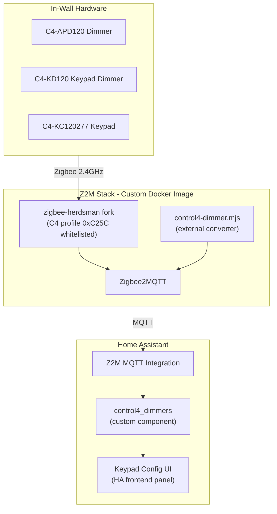

# Control4 Zigbee Integration for Home Assistant

## Current State

**This repo** (`homeassistant-control4-dimmers`): Scaffolded HA custom component from the blueprint template. Placeholder code, mixed naming (still references `integration_blueprint` in several files). No real Control4 logic.

**Exploration repo** (`control4-zigbee-migration`): 7 sessions of deep work (Feb 7-10, 2026). Contains:

- A 1044-line Z2M external converter (`control4-dimmer.mjs`) supporting 3 device types (APD120 dimmer, KD120 keypad dimmer, KC120277 pure keypad)
- Reverse-engineered C4 text protocol docs (raw ASCII over APS, profile 0xC25C, no ZCL framing)
- Runtime device detection via `c4.dmx.dim` query
- LED color control with gamma correction, exposed as HA light entities
- Button events, per-button config selects, response queue for sync query/response
- A herdsman patch script that adds 0xC25C to the EZSP profile whitelist
- Database fix script, device probe script, protocol reference docs
- One dimmer (Kitchen) migrated and working; ~29 remaining

## Architecture



## The Arc: 7 Phases (3 Newer Device Types Only -- No C4-KP6-Z)

### Phase 0: Import Exploration History + Project Plan

Use `git subtree` or `git read-tree` to pull the exploration repo into `exploration/` with full commit history preserved. This keeps the reverse-engineering work, protocol docs, session logs, and original converter accessible.

Also commit this plan as `PLAN.md` at the repo root so it's versioned and anyone working on the project can refer back to it.

### Phase 1: Clean Converter + Test Framework

Extract the converter from `exploration/` into a proper location and build a test harness around it.

**Directory structure:**

```
z2m/
  converters/
    control4.mjs           -- cleaned-up converter (from exploration)
  tests/
    control4.test.mjs      -- unit tests for the converter
    fixtures/               -- mock device data, sample C4 responses
  package.json             -- vitest + zigbee-herdsman-converters dev dep
```

**Test coverage targets:**

- Color conversion: HSV-to-RGB, XY-to-RGB, gamma correction, round-trip fidelity
- C4 text protocol: command formatting, sequence numbering, response parsing
- LED color response parsing (`parseLedColorResponse`, `parseDimResponse`)
- Device detection logic (dimmer/keypaddim/keypad from `c4.dmx.dim` response)
- Button event parsing (bp, cc, sc patterns)
- fromZigbee: response queue mechanism, pending query resolution + timeout
- toZigbee: LED set command generation, batch mode, single mode
- Edge cases: empty responses, malformed text, timeout behavior

**Testing approach:** Use `vitest` with mocked `device.getEndpoint()` / `endpoint.sendRequest()`. The converter's architecture (pure functions for parsing, async functions for I/O) makes it naturally testable -- mock the I/O layer and test the logic directly.

### Phase 2: Herdsman Fork with C4 Profile Patch

The EZSP adapter in `zigbee-herdsman` silently drops messages on non-standard Zigbee profiles. The exploration repo has a bash script that `sed`-patches the compiled JS inside Docker at runtime -- fragile and lost on every update.

**Proper fix:** Fork `zigbee-herdsman`, apply the patch as a source-level change, publish as a scoped npm package or reference via git URL.

**The patch itself is small** (one line in `src/adapter/ember/ezsp/ezsp.ts`): add `|| apsFrame.profileId === 0xC25C` to the profile whitelist alongside Shelly's custom profile.

**Fork:** [bharat/zigbee-herdsman](https://github.com/bharat/zigbee-herdsman.git) (already forked from Koenkk/zigbee-herdsman)

**Steps:**

1. Create a branch `control4-profile-support` on the fork
2. Apply the one-line change in source (`src/adapter/ember/ezsp/ezsp.ts`)
3. Reference via `git+https://github.com/bharat/zigbee-herdsman.git#control4-profile-support` in the Docker build

**Upstream:** Deferred. We'll validate the full approach end-to-end first, then decide if/when to submit a PR. The Shelly precedent (custom profile whitelist) makes the case straightforward when we're ready.

### Phase 3: Custom Docker Image for Z2M

Build a Z2M Docker image that bundles the herdsman fork + converter. This is the deployment vehicle for production.

**Dockerfile approach:**

```
z2m/
  Dockerfile              -- based on koenkk/zigbee2mqtt, overlays our converter + herdsman
  docker-compose.yml      -- for local dev/testing
  .env.example            -- MQTT broker, Z2M data dir, coordinator device
```

**Build strategy:**

- Base: `koenkk/zigbee2mqtt:latest` (official image)
- Layer 1: Replace `zigbee-herdsman` with our fork (`npm install` or file copy)
- Layer 2: Copy `control4.mjs` into `/app/data/external_converters/`
- Result: Drop-in replacement for the stock Z2M image

**CI/CD:**

- GitHub Actions workflow: build on push to `main`, tag-based releases
- Push to `ghcr.io/bharat/zigbee2mqtt-control4:latest` and `:vX.Y.Z`
- Fast-track dev: `make deploy` script that builds locally and `docker save | ssh | docker load` to prod server
- Eventually Docker Hub if community adoption warrants

### Phase 4: Complete Device Support

The converter handles the protocol but several features are untested or incomplete (from PROGRESS.md Phase 5 checklist):

**Remaining work:**

- Test unified converter with all 3 newer device types (APD120, KD120, KC120277)
- Test button events (bp, sc, cc) reaching HA as action events
- Test LED color control per-button (modes 03/04/05 for all 6 slots)
- Test smart behavior (button press triggers genOnOff toggle on EP1)
- Test `c4_detect` auto-population of stored LED colors
- Expose `c4.dmx.ls` telemetry as HA sensor entities (voltage, current, power, temperature, energy)
- Expose dimming table parameters (`c4.dm.tv`) as HA number entities (ramp rates, min/max brightness)
- Batch migration of remaining ~29 dimmers

### Phase 5: HA Custom Component (Keypad Configuration)

Once Z2M handles all device communication, the HA custom component serves a focused role: **keypad button configuration UI**.

The 6-slot C4 keypads have a modular button layout (1/2/3-slot buttons, rockers, up/down) that's configured via drag-and-drop in Composer Pro. We need an equivalent in HA.

**Scope:**

- Config flow: discover Control4 devices from Z2M MQTT
- Keypad configuration entity: button layout, per-button behavior, LED colors
- No device communication -- all commands route through Z2M MQTT
- HACS-compatible for easy community installation

### Phase 6: Keypad Configuration Frontend

A custom HA frontend panel (Lovelace card or panel) for visual keypad configuration:

- Visual representation of the 6-slot chassis
- Drag-and-drop button assembly (1-slot, 2-slot, 3-slot, rocker)
- Per-button settings: name, behavior (keypad/toggle/on/off), LED on-color, LED off-color
- Live preview of LED colors
- Writes configuration via MQTT to Z2M, which sends C4 text commands

This is the biggest UX piece and should come after all device support is solid.

### Phase 7: Upstream Contributions (Deferred)

Not starting upstream PRs until the full approach is validated end-to-end. When we're ready:

- PR to `zigbee-herdsman`: C4 profile whitelist (one-line change, Shelly precedent)
- PR to `zigbee-herdsman-converters`: Control4 device converter
- Clean up `console.error` debug calls, add proper Z2M logging
- Document the `sendRequest()` bypass (may need an official API from herdsman)
- Community documentation: migration guide, supported devices, troubleshooting

## Immediate Next Steps (What We Build First)

1. Import exploration repo into `exploration/` -- **DONE**
2. Set up `z2m/` directory with the cleaned converter and test framework
3. Write initial test suite covering color math, protocol formatting, and detection logic
4. Set up Docker build pipeline (Dockerfile + GitHub Actions)
5. Clean the HA custom component scaffold (fix naming, remove placeholder code)
