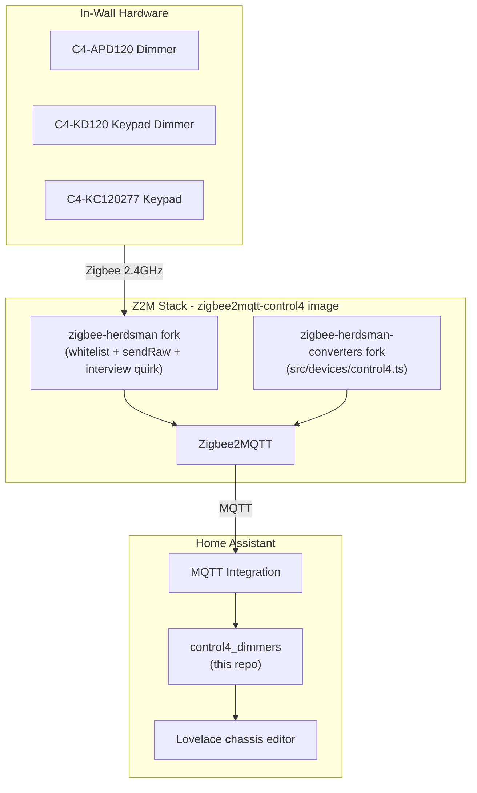

# Control4 Zigbee Integration for Home Assistant

## Current State

**This repo** is the HA custom integration (`control4_dimmers`): fully
functional, running in production against a 31-device fleet.

- MQTT-based device discovery from Zigbee2MQTT (`bridge/devices`)
- Automatic device type detection (dimmer / keypad-dimmer / keypad) via `c4_device_type` MQTT field
- Event entities for each physical button slot
- Per-slot LED color/mode configuration pushed to device firmware
- Persistent device configuration storage with snapshot/restore
- Bundled Lovelace card (`control4-dimmer-card`) with dashboard view and visual chassis editor
- WebSocket API for card-to-backend communication
- Development simulator (`scripts/simulate_devices.py`) with fake Control4 devices

**The Zigbee side** lives in separate repos (moved out of this one in 2026-08):

- [bharat/zigbee-herdsman](https://github.com/bharat/zigbee-herdsman) branch `control4-prod`: profile `0xC25C` whitelist, `Endpoint.sendRaw` (bare-APS transmit for the ASCII protocol), and an interview quirk so C4 devices pair with a clean interview.
- [bharat/zigbee-herdsman-converters](https://github.com/bharat/zigbee-herdsman-converters) branch `control4`: `src/devices/control4.ts`, the in-tree device definition (ported from the original external converter with its full test suite; 180 tests including a frozen MQTT contract test).
- [bharat/zigbee2mqtt-control4](https://github.com/bharat/zigbee2mqtt-control4): the Docker image that builds both forks from source and swaps them into stock `koenkk/zigbee2mqtt`, with version-skew and content verification. Running in production.

C4 devices are **natively supported** on this stack: clean interviews at
pairing, no external converter, no sed patch.

## Architecture

```mermaid
graph TB
  subgraph wall [In-Wall Hardware]
    APD120["C4-APD120 Dimmer"]
    KD120["C4-KD120 Keypad Dimmer"]
    KC120["C4-KC120277 Keypad"]
  end

  subgraph z2m_stack [Z2M Stack - zigbee2mqtt-control4 image]
    Herdsman["zigbee-herdsman fork\n(whitelist + sendRaw + interview quirk)"]
    ZHC["zigbee-herdsman-converters fork\n(src/devices/control4.ts)"]
    Z2M["Zigbee2MQTT"]
  end

  subgraph ha [Home Assistant]
    MQTT_Int["MQTT Integration"]
    CustomComp["control4_dimmers\n(this repo)"]
    KeypadUI["Lovelace chassis editor"]
  end

  wall -->|Zigbee 2.4GHz| Herdsman
  Herdsman --> Z2M
  ZHC --> Z2M
  Z2M -->|MQTT| MQTT_Int
  MQTT_Int --> CustomComp
  CustomComp --> KeypadUI
```

## Phase history

| Phase | Status | Where it lives now |
| --- | --- | --- |
| 1. Clean converter + test framework | DONE | Ported to `src/lib/control4.ts` + `src/devices/control4.ts` in the converters fork, tests included |
| 2. Herdsman C4 profile support | DONE | Fork branch `control4-prod` (source-level, no more sed patch) |
| 3. Custom Docker image | DONE | [zigbee2mqtt-control4](https://github.com/bharat/zigbee2mqtt-control4), CI-built, weekly rebuilds |
| 4. Complete device support | MOSTLY DONE | All 31 production devices migrated and validated (all three device types, button events, LED control, manual-paddle state sync, fresh pairing with clean interview). Remaining below |
| 5. HA custom component | DONE | This repo |
| 6. Keypad configuration frontend | DONE | This repo |
| 7. Upstream contributions | IN PROGRESS | See below |

## Phase 7: Upstream (in progress)

Tracked in [issue #104](https://github.com/bharat/homeassistant-control4-dimmers/issues/104). The strategy: production evidence first, minimal PRs second.

- **PR 1 to `Koenkk/zigbee-herdsman`**: the profile whitelist only (+8/-2, Shelly precedent #1418). Branch `control4-profile` is ready on the fork.
- **Feature request to herdsman**: a public `Endpoint.sendRaw` for non-ZCL vendor payloads, pointing at the fork's working implementation and its consumer. Filed alongside PR 1, with ArcadeMachinist (who requested exactly this in #1792) looped in.
- **Interview quirk PR**: the manufacturerID-keyed quirk; Koenkk pre-approved this category of change on #1792.
- **PR 2 to `zigbee-herdsman-converters`**: `control4.ts`, scoped to what upstream capabilities support, after PR 1 lands.

## Remaining Work

- Upstream campaign (Phase 7, above)
- Expose `c4.dmx.ls` telemetry as HA sensor entities (voltage, current, power, temperature, energy)
- Expose dimming table parameters (`c4.dm.tv`) as HA number entities (ramp rates, min/max brightness)
- HACS default-repository inclusion (gated on upstream support so strangers get a working stack)
